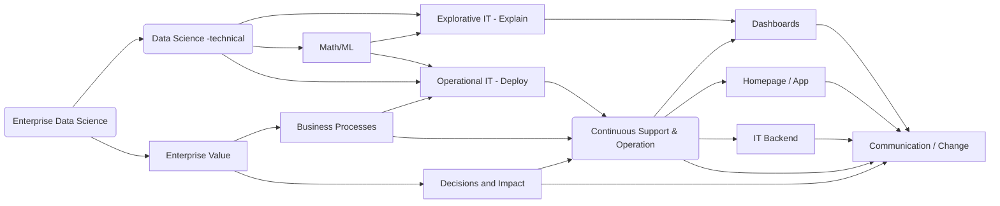

## Lecture - Introduction to Data Science

Focus in this lecture is to transport my practice into the classroom by applying an inverted class room concept.

The lecture addresses students that are interested in the topic of enterprise data science which is linking the enterprise business perspective to pragmatic mathematical model designing and IT constraints. All three topics are addressed – examples are presented with respect to machine learning and predictive models  in python.

The age data driven apps and data driven decisions describes the change in business and technology where modern information technology is penetrating all industrial processes.
Here, each human touchpoint which can be desired will be automated while continuously gathering more and more information. The age of data gathering started already 20 years ago and is often coined under the term big data. Today, big data is any data that is expensive to manage and hard to extract value from.

 Predictive Analytics is the art to extract value out of big data with the task to leveraging industrial revenues. In this lecture we focus on predictive modeling (machine learning) via python and how to solve the related business problem.

 Programming skills are mandatory for a data scientist; thus, programming exercises have to done by the students. Predictive models forecast the future given historic data sets. For this machine learning becomes mandatory. In this lecture we will use the so-called scikit-learn python library and tensorflow to demonstrate pitfalls and best practices to solve a problem.
In addition the link to modern business intelligence (BI) tools and in-memory data bases is presented.

 Note that a full coverage of these topics is not possible. Thus, only basic concepts are sketched by using demos, SQL and the python programming language. One of the chief pitfalls of data analysis is attempting to solve the wrong problem. Thus, the lecture focuses heavily on the business side and how to address the correct data questions. Persons responsible to solve data science problem in industry needs to solve a business problem. The job profile is often denoted as data scientists. A further description of enterprise data science can be found within the [complementary blog posts](/docs/enterprise_data_science
)

#### used python packages in the lecture

```
- numpy
- pandas
- scikit-learn
- bokeh
- seaborn
- tensorflow
```

<!--more-->
#### High level enterprise data science flow graph

The graph gives only a very high level abstraction of enterprise data science. Note, that many lectures are focusing on the top (technical) data science part. Which is important especially to train mandatory programming / math skill sets, however, the enterprise world is more complicated. The link to business and the impact is vey challenging. In the lecture series we try to address some high level aspects.


