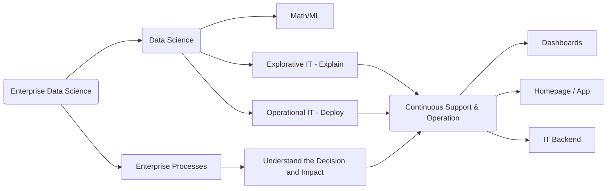

## Lecture - Introduction to Data Science

Focus in this lecture is to transport my practice into the classroom by applying an inverted class room concept.

The lecture addresses students that are interested in the topic of big data, programming skills and business models. All three topics are addressed – examples are presented with respect to predictive models in python. The internet-of-things describes the change in technology where modern information technology is penetrating all industrial processes. Here, each device, machine, and sensors are connected to gather information. The age of data gathering started already 10 years ago and is often coined under the term big data. Today, big data is any data that is expensive to manage and hard to extract value from. Predictive Analytics is the art to extract value out of big data with the task to leveraging industrial revenues. In this lecture we focus on predictive modeling (machine learning) via python and how to solve the related business problem. Programming skills are mandatory for a data scientist; thus, programming exercises have to done by the students. Predictive models forecast the future given historic data sets. For this machine learning becomes mandatory. In this lecture we will use the so-called scikit-learn python library to demonstrate pitfalls and best practices to solve a problem. Note that a full coverage of these topics is not possible. Thus, only basic concepts are sketched by using the python programming language. One of the chief pitfalls of data analysis is attempting to solve the wrong problem. Thus, the lecture focuses heavily on the business side and how to address the correct data questions. Persons responsible to solve data science problem in industry needs to solve a business problem. The job profile is often denoted as data scientists.

#### used python packages in the lecture

```
- numpy
- pandas
- scikit-learn
- bokeh
- seaborn
- tensorflow
```

<!--more-->


