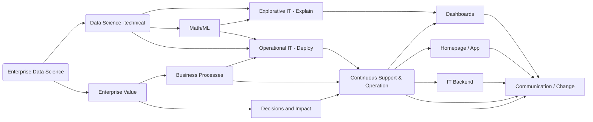

## Lecture - Enterprise Data Science

Focus in this lecture is to transport industry best practices into the classroom by applying an inverted classroom concept.

The lecture addresses students that are interested in the topic of data science applied within large cooperations. Enterprise data science is linking the business perspective to realistic mathematical models and the constraints of an enterprise IT environment. All three topics address the lecture with a focus on applied machine learning and predictive models in Python.

The age of data-driven apps and data-driven decisions describes the change in business and technology, where modern information technology is penetrating all industrial processes. Within this digital transformation, many human activities that can be described might be automated, while more and more data are continuously collected. The age of data gathering started already 20 years ago and is often coined under the term big data. Today, big data is any data that is expensive to manage and hard to extract value from.
Predictive Analytics is the art to extract value out of big data with the task of leveraging industrial revenues by serving customers. In this lecture, we focus on predictive modeling (machine learning) via Python and how to solve the related business problem.
Programming skills are mandatory for a data scientist; thus, programming exercises have to be done by the students. Predictive models forecast the future given historical data sets. For this machine learning might become appropriate. We will use the scikit-learn Python library and TensorFlow to demonstrate pitfalls and best practices to solve a problem. Also, the link to advanced business intelligence (BI) tools and in-memory databases is presented.
Note that full coverage of these topics is not possible, and only a selective view is presented. Thus, only basic concepts are sketched by using demos, SQL, Python, and business process modeling and notation (BPMN) representation.

One of the chief pitfalls of data analysis is attempting to solve the wrong problem. Thus, the lecture focuses heavily on the business side and how to address the right data questions. Persons responsible for solving data science problem in the industry needs to solve a business problem. The job profile is often denoted as data scientists. A further description of enterprise data science can be found within the [complementary blog posts](/docs/enterprise_data_science
)

#### used python packages in the lecture

```
- numpy
- pandas
- scikit-learn
- bokeh
- seaborn
- tensorflow
```

<!--more-->
#### High level enterprise data science flow graph

The graph gives only a very high level abstraction of enterprise data science. Note, that many lectures are focusing on the top (technical) data science part. Which is important especially to train mandatory programming / math skill sets, however, the enterprise world is more complicated. The link to business and the impact is vey challenging. In the lecture series we try to address some high level aspects.


